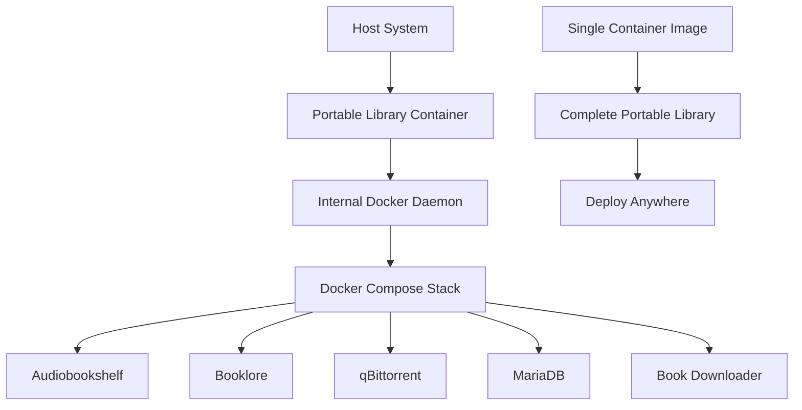

# Docker-in-Docker Containerization Solution Analysis

## Executive Summary

The Docker-in-Docker (DinD) approach represents a paradigm shift from **file-based portability** to **environment-based portability**. Instead of backing up files and hoping applications preserve state, we containerize the entire stack to capture complete runtime environment and application state.

## The Core Problem Revisited

Our analysis revealed that while data folders ARE being backed up correctly, applications still require setup because:

1. **Runtime State vs File State**: Applications store critical state in memory, processes, and runtime configurations not captured by file backups
2. **Environment Dependencies**: Applications depend on specific environment conditions that may vary between deployments
3. **Initialization Logic**: Applications have complex startup logic that determines whether they're "configured" or need setup

## Docker-in-Docker Solution Architecture

### Concept Overview


### Technical Implementation

**Base Container Structure:**
```dockerfile
FROM docker:dind
COPY docker-compose.yml /app/
COPY library/ /app/library/
COPY .env /app/
COPY Makefile /app/
WORKDIR /app
CMD ["sh", "-c", "dockerd-entrypoint.sh & sleep 10 && docker compose up -d && tail -f /dev/null"]
```

## Why This Solves the State Preservation Problem

### 1. Complete Environment Capture
- **Runtime State**: Container snapshots preserve running processes and memory state
- **Network State**: Internal Docker networks and service discovery preserved
- **File System State**: All files, permissions, and metadata exactly preserved
- **Process State**: Applications remain running with their exact configuration

### 2. Elimination of Initialization Logic
- **No Cold Starts**: Applications never go through initialization routines
- **Preserved Sessions**: User sessions and authentication state maintained
- **Configuration Continuity**: Runtime configurations remain active
- **Service Discovery**: Inter-service connections remain established

### 3. True Environment Isolation
- **Consistent Runtime**: Same Docker daemon, same network, same everything
- **No Host Dependencies**: Zero reliance on host system configuration
- **Predictable Behavior**: Identical environment every time
- **Version Consistency**: Exact same Docker and application versions

## Implementation Approaches

### Approach 1: Single Mega-Container
**Pros:**
- Ultimate simplicity - one container to rule them all
- Perfect state preservation
- Zero setup after deployment

**Cons:**
- Large container size
- Complex internal orchestration
- Harder to update individual services

### Approach 2: Container with External Volume
**Pros:**
- Data persistence outside container
- Easier updates and maintenance
- Smaller container size

**Cons:**
- Still relies on volume mounting
- May not solve all state issues

### Approach 3: Container Snapshots
**Pros:**
- Perfect state preservation through snapshots
- Can rollback to any previous state
- True point-in-time recovery

**Cons:**
- Requires container runtime support
- Larger storage requirements

## Recommended Implementation: Hybrid Approach

### Phase 1: DinD Base Container
```dockerfile
FROM docker:24-dind
RUN apk add --no-cache docker-compose make curl

# Copy application stack
COPY docker-compose.yml /portable-library/
COPY library/ /portable-library/library/
COPY .env /portable-library/
COPY Makefile /portable-library/

WORKDIR /portable-library

# Startup script
COPY startup.sh /startup.sh
RUN chmod +x /startup.sh

EXPOSE 3306 6060 8080 8084 13378

CMD ["/startup.sh"]
```

### Phase 2: Intelligent Startup Script
```bash
#!/bin/sh
# startup.sh

echo "Starting Docker daemon..."
dockerd-entrypoint.sh &

# Wait for Docker daemon
echo "Waiting for Docker daemon..."
while ! docker info >/dev/null 2>&1; do
    sleep 1
done

echo "Docker daemon ready. Starting portable library stack..."
cd /portable-library

# Start the stack
make start

# Health check loop
while true; do
    if ! docker compose ps --status running | grep -q "Up"; then
        echo "Services not healthy, restarting..."
        make start
    fi
    sleep 30
done
```

## Benefits Analysis

### Portability Benefits
- **True Portability**: Single container runs anywhere Docker is available
- **Zero Configuration**: No host system setup required
- **Consistent Behavior**: Identical experience across all deployments
- **Version Lock**: Exact same versions of all components

### State Preservation Benefits
- **Complete State**: Runtime state, not just file state
- **No Setup Required**: Applications start already configured
- **User Experience Continuity**: All preferences and settings preserved
- **Service Integration**: Inter-service connections maintained

### Operational Benefits
- **Simple Deployment**: `docker run` and you're done
- **Easy Backup**: Container snapshots or image exports
- **Rollback Capability**: Revert to previous container states
- **Disaster Recovery**: Complete system restoration from single image

## Challenges and Mitigations

### Challenge 1: Container Size
**Issue**: Large container images due to multiple services
**Mitigation**: 
- Multi-stage builds to minimize layers
- Use Alpine-based images where possible
- Implement container registry with layer caching

### Challenge 2: Resource Usage
**Issue**: Docker-in-Docker overhead
**Mitigation**:
- Resource limits and monitoring
- Efficient container scheduling
- Optional service profiles for different use cases

### Challenge 3: Security Considerations
**Issue**: Privileged container requirements for DinD
**Mitigation**:
- Use rootless Docker where possible
- Implement proper security contexts
- Network isolation and access controls

### Challenge 4: Updates and Maintenance
**Issue**: Updating services within the container
**Mitigation**:
- Versioned container releases
- Blue-green deployment strategies
- Automated update mechanisms

## Implementation Roadmap

### Phase 1: Proof of Concept (Week 1)
1. Create basic DinD container with current stack
2. Test state preservation across container restarts
3. Validate all services work within container environment
4. Measure performance impact

### Phase 2: Production Implementation (Week 2-3)
1. Optimize container size and startup time
2. Implement health checks and monitoring
3. Create backup/restore mechanisms for container state
4. Add configuration management for different deployment scenarios

### Phase 3: Advanced Features (Week 4)
1. Implement container snapshot capabilities
2. Add automated update mechanisms
3. Create deployment orchestration tools
4. Develop monitoring and logging solutions

## Success Metrics

### Primary Goals
- **Zero Setup Time**: Applications start fully configured
- **100% State Preservation**: All user data and preferences maintained
- **Single Artifact Deployment**: One container image contains everything
- **Cross-Platform Compatibility**: Runs identically on any Docker host

### Performance Targets
- **Startup Time**: < 2 minutes for complete stack
- **Resource Overhead**: < 20% additional resource usage vs native
- **Container Size**: < 2GB for complete portable library
- **Update Time**: < 5 minutes for service updates

## Risk Assessment

### High Risk
- **Docker-in-Docker Complexity**: Requires careful configuration and monitoring
- **Security Implications**: Privileged containers need proper security measures

### Medium Risk
- **Performance Impact**: Additional containerization layer may affect performance
- **Storage Requirements**: Larger storage footprint for container images

### Low Risk
- **Compatibility Issues**: Docker standardization minimizes compatibility problems
- **Maintenance Overhead**: Well-established DinD patterns available

## Conclusion

The Docker-in-Docker approach represents a fundamental shift from **file-based portability** to **environment-based portability**. By containerizing the entire stack, we achieve:

1. **True State Preservation**: Complete runtime environment captured
2. **Zero Setup Deployment**: Applications start fully configured
3. **Ultimate Portability**: Single container runs anywhere
4. **Consistent Experience**: Identical behavior across all deployments

This solution directly addresses the root cause of our application state preservation issues by eliminating the need for applications to go through initialization routines after deployment.

**Recommendation**: Proceed with Phase 1 implementation to validate the approach and measure the benefits against the current file-based backup system.